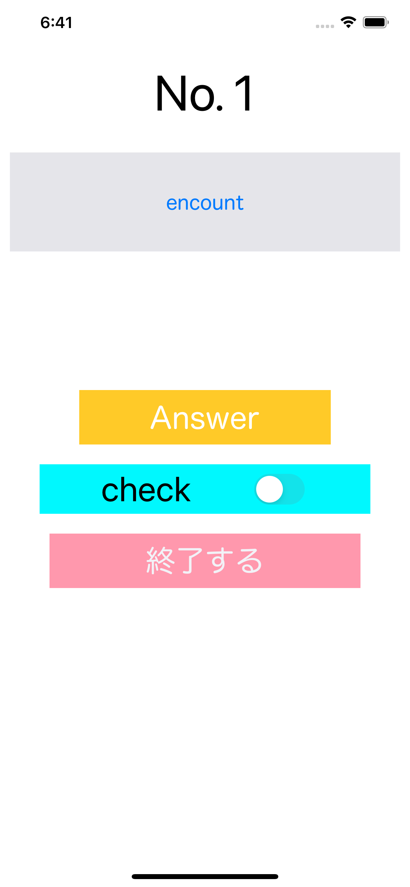
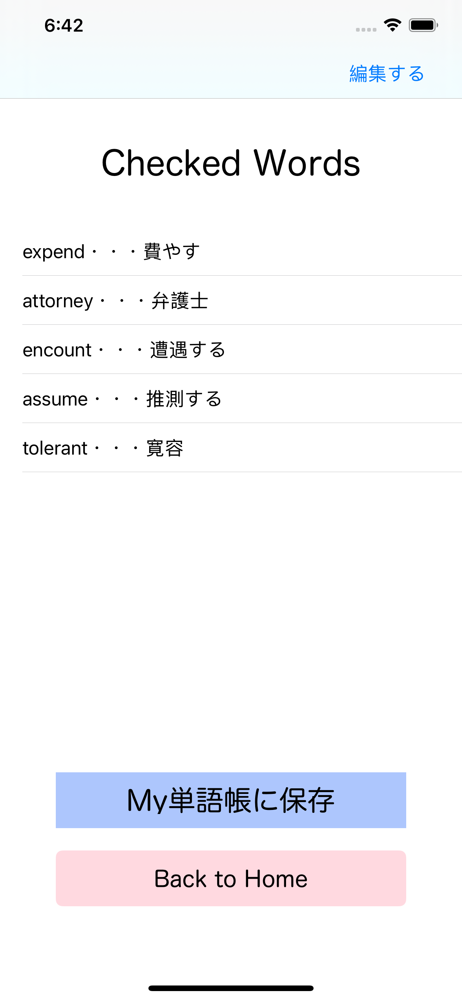

# PsychologyEnglish

## 概要

心理学に関する英単語を覚えることを目的にしたアプリ  
  
## 機能

構造はシンプルで英単語を表示した後にanswerボタンを押すことで答えを表示する。また、わからなかった単語はcheckを入れることで結果画面の際にCheckWordsとして表示される。その単語をMy単語帳に保存すれば後々見返すことができ、また、My単語帳に含まれる単語だけをテストすることができる。
  
## スクリーンショット

## 注意事項

このアプリの単語データは出版されているある本から引用しているためAppStoreには公開していません。ですが、単語のデータを入れ替えたものをEnglishTrainingという名前でAppStoreに公開しております。  
URLはこちらです  
https://apps.apple.com/jp/app/englishtraining/id1618582567